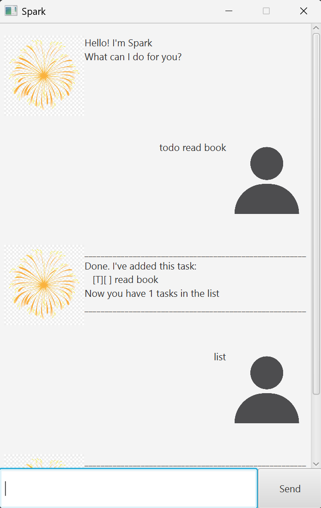

# Spark User Guide



Spark is a task management chatbot that helps you manage todos, deadlines, and events quickly using typed commands.
It supports a simple GUI where you type commands and Spark replies in the chat window.


---

## Command summary

| Command      | Format                                         |
|--------------|------------------------------------------------|
| Add todo     | `todo <description>`                           |
| Add deadline | `deadline <description> /by <yyyy-MM-dd HHmm>` |
| Add event    | `event <description> /from <start> /to <end>`  |
| Mark task    | `mark <taskNumber>`                            |
| Unmark task  | `unmark <taskNumber>`                          |
| List tasks   | `list`                                         |
| Delete task  | `delete <taskNumber>`                          |
| Find tasks   | `find <keyword>`                               |
| Sort tasks   | `sort`                                         |
| Exit         | `bye`                                          |


## Adding a todo

Adds a todo task.

Format: `todo <description>`

Example:
```
todo buy groceries
```

Output:
```
_______________________________________________________
Done. I've added this task:
   [T][ ] buy groceries
Now you have 1 tasks in the list.
_______________________________________________________
```

---

## Adding a deadline

Adds a deadline task with a date-time.

Format:
`deadline <description> /by <yyyy-MM-dd HHmm>`

Example:
```
deadline return book /by 2025-01-25 1200
```

Output:
```
_______________________________________________________
Done. I've added this task:
   [D][ ] return book (by: Jan 25 2025, 12:00PM)
Now you have 2 tasks in the list.
_______________________________________________________
```

---
## Adding an event

Adds an event task with a start and end.

Format:
`event <description> /from <start> /to <end>`

Example:
```
event project meeting /from 2pm /to 4pm
```

Output:
```
_______________________________________________________
Done. I've added this task:
   [E][ ] project meeting (from: 2pm to: 4pm)
Now you have 3 tasks in the list.
_______________________________________________________
```
---

## Marking a task as done

Marks a task as completed.
Task becomes done and shows `[X]`.

Format:
`mark <taskNumber>`

Example:
```
mark 2
```

Output:
```
_______________________________________________________
Nice! I've marked this task as done:
   [D][X] return book (by: Jan 25 2025, 12:00PM)
_______________________________________________________
```

---

## Unmarking a task

Marks a task as not done.
Task becomes not done and shows `[ ]`.

Format:
`unmark <taskNumber>`

Example:
```
unmark 2
```

Output:
```
_______________________________________________________
OK, I've marked this task as not done yet:
   [D][ ] return book (by: Jan 25 2025, 12:00PM)
_______________________________________________________
```

---


## Listing tasks

Shows all tasks currently stored.

Format: `list`

Output:
```
_______________________________________________________
Here are the tasks in your list:
1. [T][ ] buy groceries
2. [D][ ] return book (by: Jan 25 2025, 12:00PM)
3. [E][ ] project meeting (from: 2pm to: 4pm)
_______________________________________________________
```

---
## Deleting a task

Deletes a task from the list at the given task number.

Format:
`delete <taskNumber>`

Example:
```
delete 1
```

Output:
```
_______________________________________________________
Noted. I've removed this task:
   [T][ ] buy groceries
Now you have 2 tasks in the list.
_______________________________________________________
```
---

## Finding tasks

Finds tasks whose description contains a keyword.

Format:
`find <keyword>`

Example:
```
find book
```

Output:
```
_______________________________________________________
Here are the matching tasks in your list:
1. [D][ ] return book (by: Jan 25 2025, 12:00PM)
_______________________________________________________
```

---
### Sort tasks

Sorts your task list by deadline, earliest first. Tasks without deadline will be at the bottom. 

**Format:** `sort`

Example:
```
sort
```

After sorting, run `list` to view the tasks in the new order.

---
## Saving and loading

Spark automatically saves tasks after commands that change the list (add, mark, unmark, delete).
When Spark starts, it loads saved tasks from disk.

If loading fails (corrupted save file), Spark will start with an empty list and show one warning message.

---
